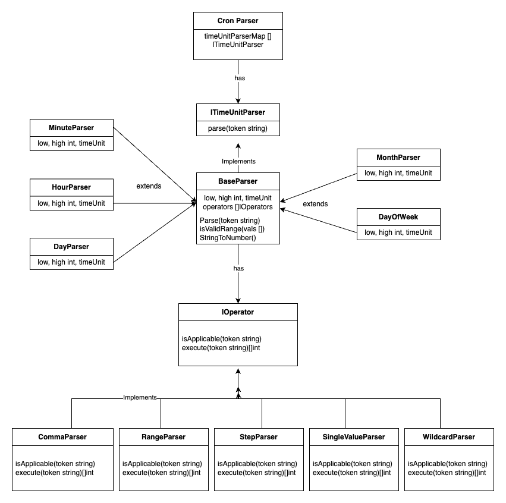

# Cron Parser

## Usage
To use the Cron Parser, follow these steps:
1. Start by running the main program:
2. Enter a cron expression on next line.
3. To exit the program, press `Ctrl+C`.

Example:
```sh
go run main.go
*/15 0 1,15 * 1-5 /usr/bin/find
```

## Running Unit Tests

To run the unit tests for the Cron Parser, use the following command:

```sh
go test ./...
```

### Class Diagram


## Project Structure

- `cronParser/cronParser.go`: Contains the main `CronParser` struct and methods for parsing cron expressions.
- `timeParser/baseParser.go`: Contains the `BaseParser` struct and methods for parsing individual time units in a cron expression.
- `cronParser/test/cronParser_test.go`: Contains unit tests for the `CronParser` functionality.
- `entity`: Contains the `Expression` struct which represents a parsed cron expression.
- `operator`: Contains various operator implementations for parsing different parts of a cron expression.
## Components

### CronParser

The `CronParser` struct is responsible for parsing the entire cron expression. It uses a map of time unit parsers to handle different parts of the expression.

### BaseParser

The `BaseParser` struct is used to parse individual time units (minute, hour, day, month, day of the week) in a cron expression. It uses a list of operators to handle different formats of the time unit.

### Expression

The `Expression` struct represents a parsed cron expression. It contains fields for each part of the cron expression (minute, hour, day, month, day of the week) and the command to be executed.

### Operators

Operators are used to parse different formats of time units in a cron expression. Examples include handling ranges (e.g., `1-5`), lists (e.g., `1,2,3`), and steps (e.g., `*/15`).


